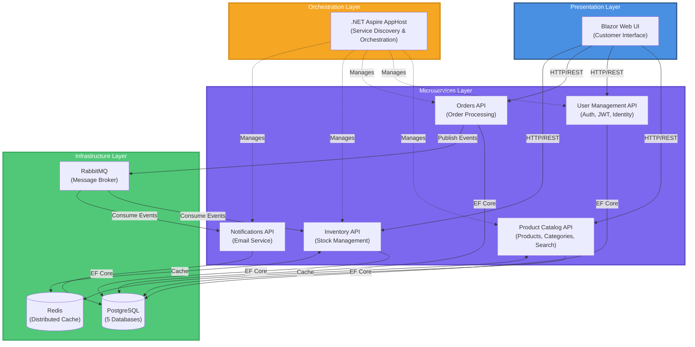

# E-Commerce Microservices Architecture

## Architecture Overview

This diagram shows the complete microservices architecture of the e-commerce application with all components and infrastructure.

### Component Description

#### Presentation Layer
- **Blazor Web UI**: Customer-facing responsive web interface built with Blazor Server and Bootstrap 5.3

#### Microservices Layer
- **Product Catalog API**: Manages products, categories, search, and filtering with Redis caching
- **User Management API**: Handles user registration, authentication (JWT), and profile management using ASP.NET Core Identity
- **Orders API**: Processes orders, maintains order history, and publishes events to RabbitMQ
- **Inventory API**: Manages stock levels, reservations, and availability checks with Redis caching
- **Notifications API**: Sends email confirmations and order notifications by consuming RabbitMQ events

#### Infrastructure Layer
- **.NET Aspire AppHost**: Orchestrates all services and provides service discovery
- **PostgreSQL**: Primary data store with separate databases per service (catalogdb, usersdb, ordersdb, inventorydb, notificationsdb)
- **Redis**: Distributed caching for product catalog and inventory data
- **RabbitMQ**: Message broker for asynchronous event-driven communication between services
