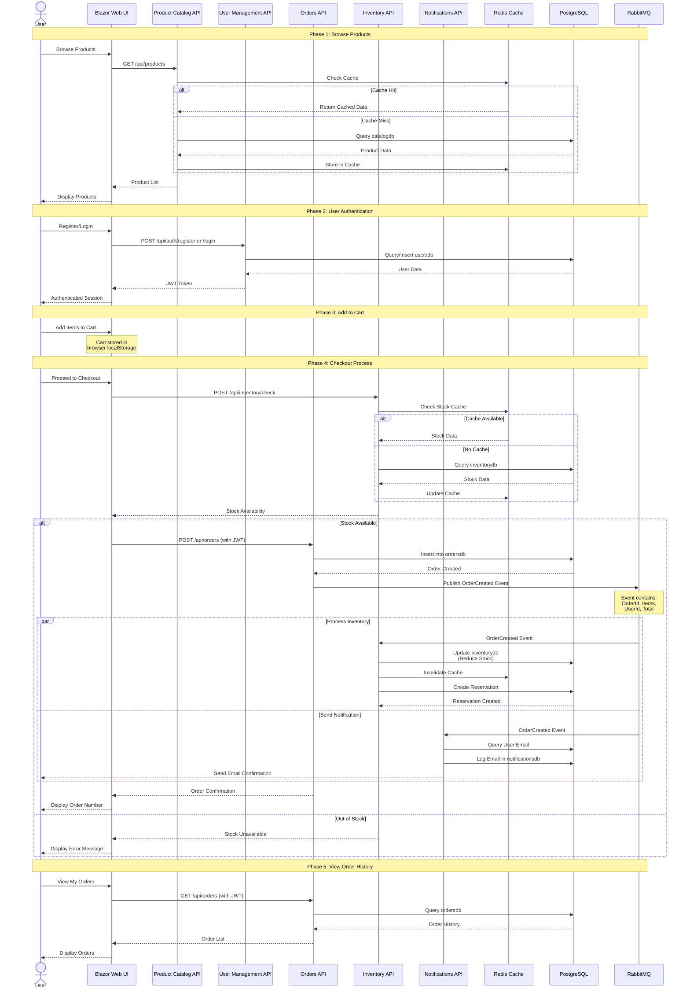

# E-Commerce Data Flow Diagram

## Complete User Journey Data Flow

This diagram illustrates the complete data flow through the system from user interaction to order completion, showing how data moves between microservices and infrastructure components.

## Key Data Flow Patterns

### 1. **Read Operations with Caching**
- Product Catalog and Inventory use Redis for caching
- Cache-aside pattern: Check cache first, then database
- Reduces database load and improves response time

### 2. **Event-Driven Architecture**
- Orders API publishes events to RabbitMQ
- Inventory and Notifications consume events asynchronously
- Ensures loose coupling between services

### 3. **Authentication Flow**
- JWT-based authentication via User Management API
- Token passed in headers for subsequent requests
- Stateless authentication across microservices

### 4. **Database per Service**
- Each microservice has its own PostgreSQL database
- Data isolation and independence
- Databases: catalogdb, usersdb, ordersdb, inventorydb, notificationsdb

### 5. **Transactional Consistency**
- Order creation triggers inventory reservation
- Email notification sent after order confirmation
- Eventual consistency via message queue

## Data Storage Details

| Service | Database | Cached Data | Message Events |
|---------|----------|-------------|----------------|
| Product Catalog | catalogdb | Products, Categories | - |
| User Management | usersdb | - | - |
| Orders | ordersdb | - | OrderCreated (Publish) |
| Inventory | inventorydb | Stock Levels | OrderCreated (Consume) |
| Notifications | notificationsdb | - | OrderCreated (Consume) |
