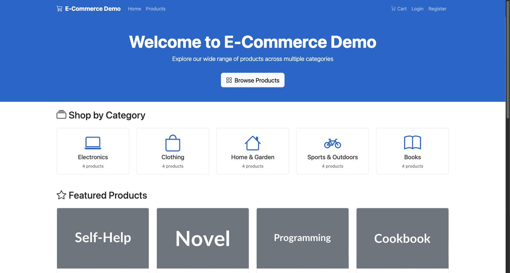
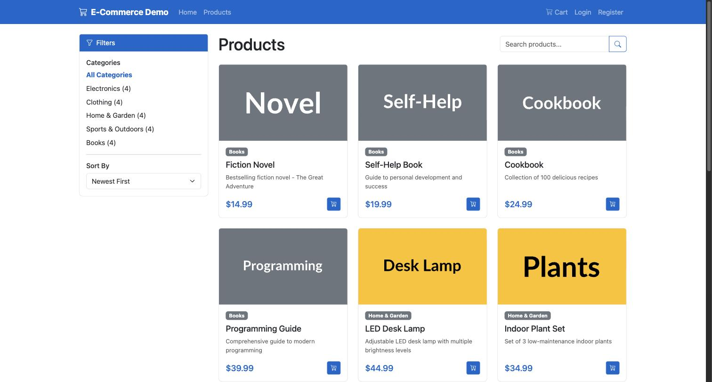
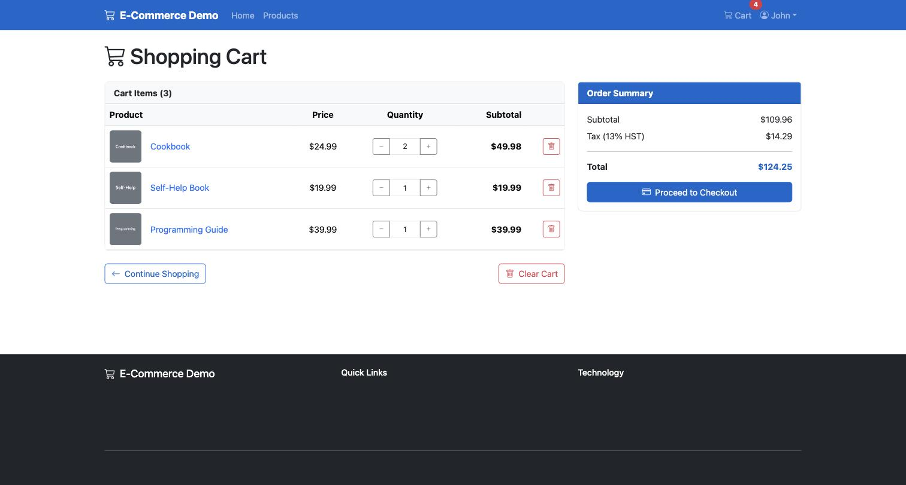
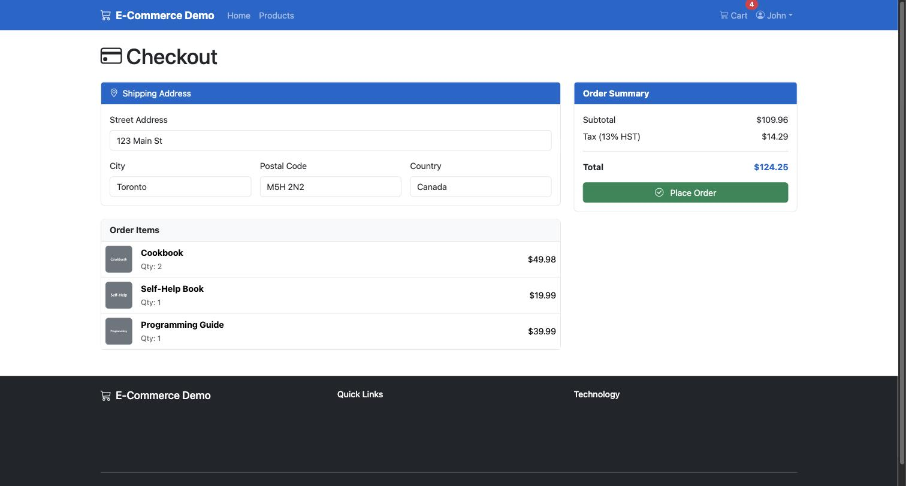
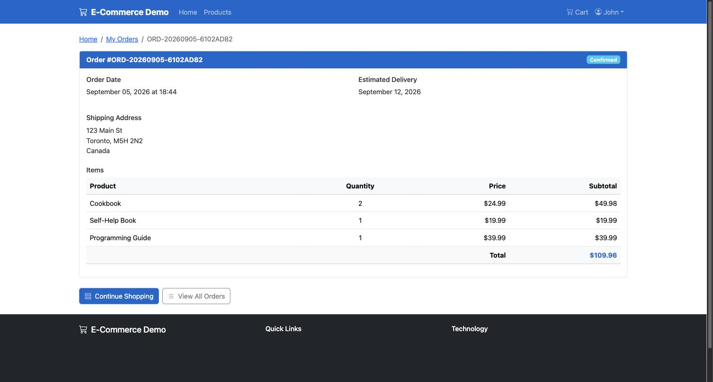
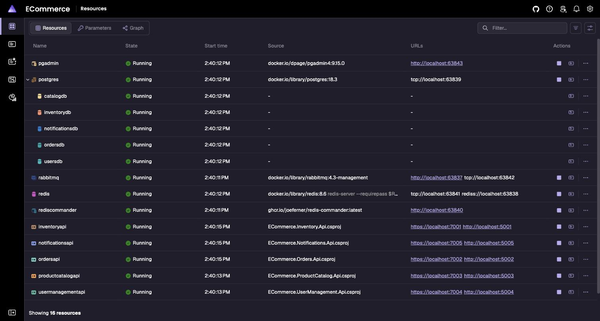

# E-Commerce Microservices Demo with .NET Aspire

[](https://github.com/nitin27may/aspire-Microservices/actions/workflows/ci.yml)
[](https://dotnet.microsoft.com/download/dotnet/10.0)
[](https://aspire.dev)
[](LICENSE)

## About

A production-quality, end-to-end e-commerce demonstration showcasing microservices architecture orchestrated by .NET Aspire. This demo serves as both a learning resource and a reference implementation demonstrating real-world microservice patterns, service communication, and distributed system orchestration.

See the [Roadmap](ROADMAP.md) for what's planned next, and [Contributing](CONTRIBUTING.md) if you'd like to help.

## Screenshots

<table>
<tr>
<td width="50%">

**Storefront**


</td>
<td width="50%">

**Product Catalog**


</td>
</tr>
<tr>
<td width="50%">

**Cart**


</td>
<td width="50%">

**Checkout**


</td>
</tr>
<tr>
<td width="50%">

**Order Confirmation**


</td>
<td width="50%">

**.NET Aspire Dashboard**


</td>
</tr>
</table>

## Architecture Overview

### Microservices
- **Product Catalog API** - Product browsing, search, category management with Redis caching
- **User Management API** - Registration, authentication (JWT), profile management with ASP.NET Core Identity
- **Order Processing API** - Order creation, order history, order status with RabbitMQ event publishing
- **Inventory API** - Stock management, reservation, availability checks with Redis caching
- **Notification API** - Email confirmations, order status notifications via RabbitMQ consumers
- **Blazor Web UI** - Customer-facing responsive web interface with Bootstrap 5.3

### Infrastructure Components
- **PostgreSQL** - Primary data store (separate databases per service)
- **Redis** - Distributed caching for product catalog and inventory
- **RabbitMQ** - Asynchronous event-driven communication between services
- **.NET Aspire AppHost** - Orchestration and service discovery

### Architecture Diagrams
For detailed architecture and data flow visualizations, see:
- [Architecture Overview Diagram](docs/architecture-overview.md) - Complete system architecture with all microservices and infrastructure
- [Data Flow Diagram](docs/data-flow-diagram.md) - End-to-end user journey showing data flow through the system

## Getting Started

### Prerequisites
- [.NET 10 SDK](https://dotnet.microsoft.com/download/dotnet/10.0)
- [Aspire CLI](https://aspire.dev/get-started/install-cli/) — `curl -sSL https://aspire.dev/install.sh | bash` (macOS/Linux) or see the link for Windows/Homebrew/npm options
- Docker Desktop (for running PostgreSQL, Redis, and RabbitMQ)

### Running the Application

1. Clone the repository:
```bash
git clone https://github.com/nitin27may/aspire-Microservices.git
cd aspire-Microservices
```

2. Run the AppHost:
```bash
cd src/ECommerce.AppHost
aspire run
```
   `dotnet run` also works as a fallback if you don't want to install the Aspire CLI, but `aspire run` is the officially recommended workflow as of Aspire 13.

3. Open the Aspire Dashboard URL shown in the console (a login link with a token, typically `https://localhost:17138/login?t=...`)

4. Click on the `webfrontend` resource's endpoint to access the e-commerce UI

### Demo Credentials
- **Email:** demo@example.com
- **Password:** Demo123!

## User Journey

1. **Browse Products** - View products by category, search, sort, and filter
2. **Add to Cart** - Products are stored in browser localStorage
3. **Checkout** - Requires authentication, validates inventory
4. **Order Confirmation** - Receives order number, email notification sent

## Database Schema

### Databases
- `catalogdb` - Products and Categories
- `usersdb` - User accounts (ASP.NET Core Identity)
- `ordersdb` - Orders and OrderItems
- `inventorydb` - Inventory and Reservations
- `notificationsdb` - Email logs

## Technology Stack

- **.NET 10** - Application framework
- **.NET Aspire 13** - Cloud-native orchestration
- **Blazor Server** - Interactive web UI
- **Entity Framework Core 10** - Data access
- **ASP.NET Core Identity** - Authentication
- **JWT Bearer** - Token-based auth
- **RabbitMQ.Client 7** (fully async API) - Message broker client
- **Redis** - Caching
- **PostgreSQL** - Database (defaults to the image Aspire's PostgreSQL hosting integration pins — currently 18.x; see [Aspire.Hosting.PostgreSQL release notes](https://github.com/dotnet/aspire) for the exact version if you need to match it elsewhere)
- **Scalar** - API documentation (replacement for Swagger)

### Keeping dependencies current

This repo pins package versions in [`src/Directory.Packages.props`](src/Directory.Packages.props) and the SDK in [`global.json`](global.json) (using `rollForward: latestFeature` so any installed .NET 10 feature band works). .NET Aspire moved from a `9.x` versioning scheme to `13.x` alongside the .NET 10 release — if you're upgrading an older clone, expect breaking changes in the RabbitMQ client (`IModel` → `IChannel`, all methods now `*Async`) and in EF Core/Identity version pins (no longer forced to 9.x). Run `dotnet outdated` or check NuGet directly before assuming a version bump is a patch-level change.

## Project Structure

```
src/
├── ECommerce.AppHost/           # Aspire orchestration host
├── ECommerce.ServiceDefaults/   # Shared service configuration
├── ECommerce.ProductCatalog.Api/ # Product catalog microservice
├── ECommerce.UserManagement.Api/ # User management microservice
├── ECommerce.Orders.Api/        # Order processing microservice
├── ECommerce.Inventory.Api/     # Inventory microservice
├── ECommerce.Notifications.Api/ # Notification microservice
├── ECommerce.Web/               # Blazor web frontend
└── Shared/
    └── ECommerce.Shared.Contracts/ # Shared event contracts
```

## API Endpoints

Each API service exposes Scalar API documentation at `/scalar/v1`.

### Product Catalog API
- `GET /api/categories` - List all categories
- `GET /api/products` - List products (with filtering, sorting, pagination)
- `GET /api/products/{id}` - Get product details
- `GET /api/products/featured` - Get featured products

### User Management API
- `POST /api/auth/register` - Register new user
- `POST /api/auth/login` - Login and get JWT token
- `GET /api/users/{userId}` - Get user profile

### Orders API
- `POST /api/orders` - Create new order (requires auth)
- `GET /api/orders` - Get user's orders (requires auth)
- `GET /api/orders/{orderNumber}` - Get order details (requires auth)

### Inventory API
- `GET /api/inventory/{productId}` - Get inventory for product
- `POST /api/inventory/check` - Check stock availability
- `POST /api/inventory/reserve` - Reserve inventory

## Email Configuration

By default, the notification service logs emails to the database. For actual email delivery:

1. Configure SMTP in `appsettings.json`:
```json
{
  "Smtp": {
    "Host": "smtp.example.com",
    "Port": 587,
    "User": "your-email@example.com",
    "Password": "your-password",
    "SenderEmail": "noreply@ecommerce.demo",
    "SenderName": "E-Commerce Demo"
  }
}
```

2. Or use SMTP4Dev for local development

## Observability

The Aspire Dashboard provides:
- **Distributed Tracing** - Track requests across services
- **Logs** - Centralized logging
- **Metrics** - Service health monitoring
- **Service Discovery** - View all running services

## Seed Data

The application comes pre-seeded with:
- 5 Categories (Electronics, Clothing, Home & Garden, Sports & Outdoors, Books)
- 20 Products (4 per category)
- 2 Test Users (demo@example.com, test@example.com)
- Initial inventory (100 units per product)

## Known Issues / Gotchas

- **Browser automation / testing tools clicking `@onclick` buttons**: some CDP-based automation tools fail to trigger Blazor Server's synthetic click delegation on plain `@onclick` buttons (forms with `EditForm`/`OnValidSubmit` and `<a>` navigation are unaffected). If you're writing E2E tests, prefer Playwright/Selenium's native click, which dispatches trusted input events correctly.
- **First `aspire run`** downloads the DCP orchestrator binary and does a one-time NuGet version check — the first run can take noticeably longer than subsequent ones.
- **Multiple .NET SDKs installed**: if `dotnet --list-sdks` shows more than one location, make sure `DOTNET_ROOT`/`PATH` resolve to the one with .NET 10, since the Aspire CLI's process resolution doesn't always match your shell's `dotnet`.

## Contributing

Contributions are welcome — see [CONTRIBUTING.md](CONTRIBUTING.md). Check the [Roadmap](ROADMAP.md) for planned work.

## License

MIT — see [LICENSE](LICENSE).
